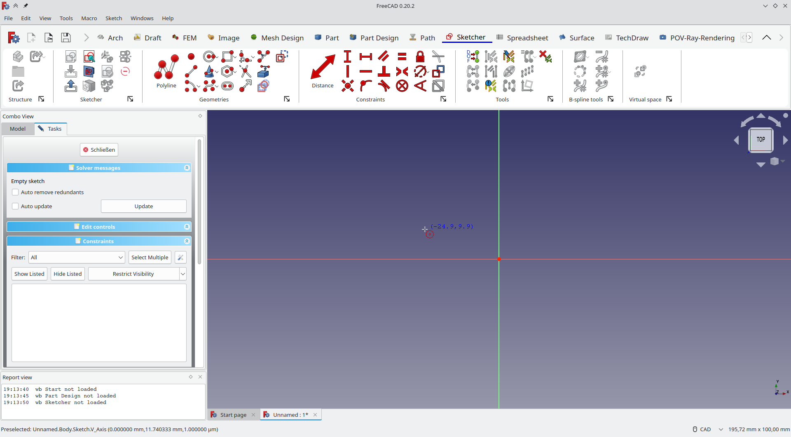

## FreeCAD Ribbon UI

A draft to implement a proper Ribbon UI for FreeCAD, based on the work of [HakanSeven](https://github.com/HakanSeven12/Modern-UI) and the [PyQtRibbon library](https://github.com/haiiliin/pyqtribbon) that got slight modifications for this purpose.



This is not finished or intended for production use, but rather to look at where the limitations of this approach, implementing it as an external Python addon, lie.

## Installation
Download this repository, extract the folder and copy it to the `Mod` folder of FreeCAD, detailed information can be found at the [FreeCAD Wiki](https://wiki.freecad.org/Installing_more_workbenches). Now restart FreeCAD and you will see a ribbon interface :)

## Uninstallation
1. Remove the folder of this in the `Mod` folder of your FreeCAD installation
1. Restart FreeCAD.
1. When you restarted you don't see any toolbar.
1. Create a macro.
1. Paste this code in to macro.
    ```python
    from PySide import QtCore, QtGui, QtWidgets
    mw = FreeCADGui.getMainWindow()
    mw.menuBar().show()

    WBList = FreeCADGui.listWorkbenches()
    for WB in WBList:
        FreeCADGui.activateWorkbench(WB)
        for tb in mw.findChildren(QtWidgets.QToolBar):
            tb.show()
    ```
1. Execute the macro
1. Restart FreeCAD.

## Settings

Since this addon is more like a draft, there is no preferences page, all settings can be accessed via  `RibbonStructure.json`, you can find the file in the folder of this addon. The file determines
- which toolbars are ignored and not displayed (`ignoredToolbars`)
- which toolbars will always display icons only, regardless of the `showText` variable (see below) (`iconOnlyToolbars`)
- which commands are displayed in the tab bar (`quickAccessCommands`)
- which workbenches do not appear in the tab bar (`ignoredWorkbenches`)
- whether small buttons display text as well (`showText`)
- the order of tools in the toolbars (`toolbars / <toolbar name> / order`)
- the size of a tool button (`toolbars / <toolbar name> / commands / <command name> / size`)
- an alternative text of a tool button (`toolbars / <toolbar name> / commands / <command name> / text`)

Until now, there are only a few defaults, more or less for testing, feel free to change something and restart FreeCAD to see the results :)

## Discussion
Feel free to discuss this addon on the [FreeCAD Forum](https://forum.freecad.org/viewtopic.php?t=79235). This is also the place where I discuss the limitations of this approach as a Python Addon.

## Known Issues
- ~~When working in the PartDesign workbench, the automatic switching to the Sketcher workbench and back doesn't work, you have to do it manually.~~ (fixed)
- ~~The workbench that should be loaded on startup is ignored, it will always start with the Arch workbench and you have to switch manually.~~ (fixed)

## License
GPL v3.0 (see [LICENSE](LICENSE))
